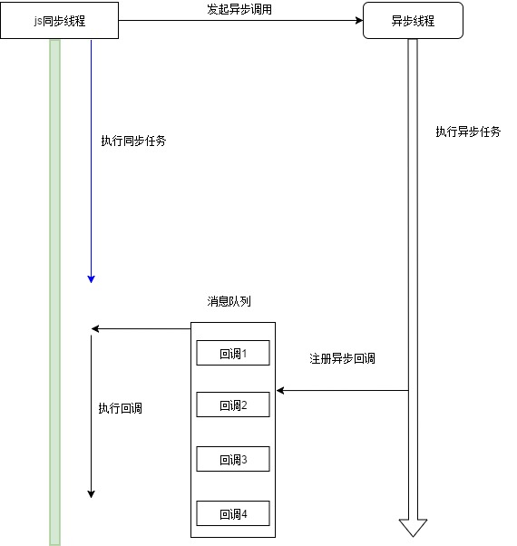
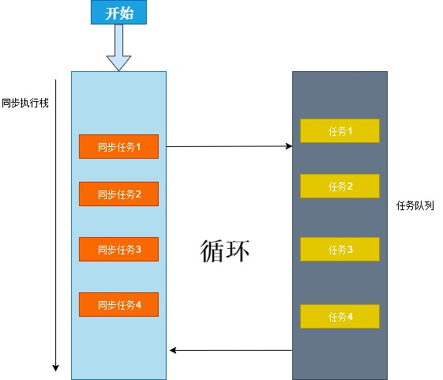
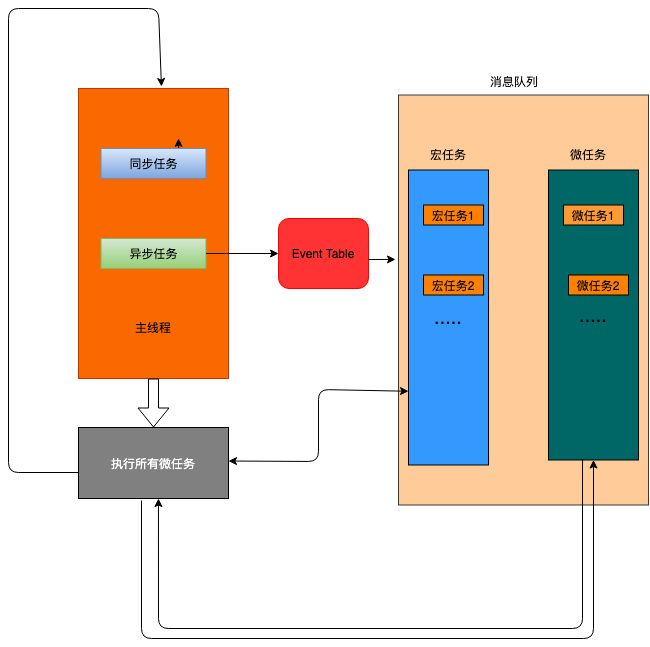

> 谈谈你是如何理解JS异步编程的，EventLoop、消息队列都是做什么的，什么是宏任务，什么是微任务？

在介绍异步编程前先说一下，javascript的相关机制，我们都知道在javascript的执行环境中，执行代码的线程只有一个，通俗的点讲就是有若干件事情都是同一个人在做，因此想要把这些事情做完的话，需一件一件的做完，这就称之为<font color=red>同步执行</font>-*阻塞*，假如中间有一件事情是烧开水，不能等着开水烧开了才继续去做事情吧，这个时候可以先把水烧上，然后继续去做别的事情，当听见水开了再去关火，这成为<font color=red>异步执行</font>-*非阻塞*。

换言而之

**同步** `就是当程序发送消息，得到响应后，才继续往下执行`
**异步** `就是程序发送消息，不等响应，继续执行，当有响应的时候执行回调`



了解了同步和异步之后，再来了解一下javascript实现异步操作的具体原理是什么呢？
这儿有几个关键字
- EventLoop
- 消息队列 - (任务队列)
- 宏任务
- 微任务

### Eventloop 
负责监听执行栈和异步队列，一旦执行栈任务结束，立即从异步队列中一次取出任务压入执行栈执行，这样依次循环



### 消息队列
就是一个一个待执行任务的集合
### 宏任务（macrotask ）、微任务（microtask）
宏任务是由宿主发起的，而微任务是由JS引擎自身发起的
哪些属于宏任务，哪些又属于微任务呢？
- 宏任务： js整体代码、setTimeout/setInterval等 （个人理解是宿主内部的API和js代码）
- 微任务：Promise、 process.nextTick等 （js引擎自身定义的异步操作）



- 1.一段代码执行过程中 有同步和异步任务，当遇到异步任务时会进入`Event Table`执行，会先将`宏任务`推入消息队列-宏任务，主线程继续执行。
- 2.主线程结束后，将从消息队列-宏任务中依次取出放入主线程中执行，等待主线程结束，将从消息队列-微任务中依次取出任务放入主线程执行，知道主线程结束。
- 3.循环 （回到第二步开始下一次）
### 异步编程

我们了解了同步和异步，以及js实现异步的原理，现在来看看在js中都有哪些异步模式？
- 1.回调函数
- 2.事件监听
- 3.观察者模式
- 4.Promise
- 5.Generator
- 6.async/await
##### 回调函数
先来说一说回调函数吧，它是异步编程的基本，其实就是在执行异步操作时将异步成功之后的动作打包注册在消息队列中，得响应之后从消息队列中把这个包取出执行，不影响主线程去做别的事儿
```javascript
function A(value) {
    console.log(value)
    console.log("开始执行A")
}
function B(callback) {
    console.log("去获取执行A指令")
    setTimeout(function() {
        callback("收到指令")
    }, 1000)
}
B(A)
console.log("C")
```
