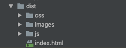

- 配置入口文件 entry
    ```javascript
    {
	  entry: './src/main.js'
    }
    ```
    执行npm run build 这个时候会报错， 需要配置解析vue模板的loader `yarn add vue-loader --dev`
- 配置vue-loader
```javascript
{
  module: {
    rules: [
      {
        test: /\.vue$/,
        loader: 'vue-loader'
      }
    ]
  },
    plugins: [
      new VueLoaderPlugin()
    ]
}
```

配置完以后 安装webpack,webpack-cli

- 配置css相关loader `yarn add style-loader css-loader --dev`
- 配置url-loader处理图片之类的 `yarn add url-loader --dev`
- 配置less-loader `yarn add less less-loader --dev`

```javascript
	module: {
		rules: [
			{
				test: /\.vue$/,
				loader: 'vue-loader'
			},
			{
				test: /\.css$/,
				use: [ 'style-loader', 'css-loader']
			},
			{
				test: /\.less/,
				use: [ 'style-loader', 'css-loader', 'less-loader']
			},
			{
				test: /\.(jpg|jpeg|png|gif|svg)$/i,
				loader: 'url-loader',
				options: {
					esModule: false, 
					name: '[name].[ext]',
					limit: 10240
				}
			}
		]
	},
```

以上配置完成以后 项目可以完成打包了

- 配置html插件 `yarn add html-webpack-plugin --dev`

- 区分生产环境配置文件（production）、基础配置文件(common)、开发配置文件(development)

- 让项目运行起来（能访问) `yarn add webpack-dev-server --dev`

  ```javascript
  //package.json
  {
     "scripts": {
      "serve": "webpack-dev-server --config webpack.common.js --mode development"
    }
  }
  ```

- 新建三种环境的配置文件，用webpack-merge插件 将所有配置文件根据环境进行合并

  ```javascript
  module.exports = (env, argv) => {
  	const config = require(`./webpack.${argv.mode}`)
  	return merge(baseConfig, config)
  }
  ```

- 配置开发配置文件

  ```javascript
  // webpack.config.development.js
  module.exports = {
  	devServer: {
  		open: true,
  		port: 3001
  	}
  }
  ```

- 提取css `yarn add mini-css-extract-plugin --dev`

  在生产环境下配置, 开发环境中还是用style-loader模式 

  ```javascript
  const MiniCssExtractPlugin = require('mini-css-extract-plugin')
  const TerserWebpackPlugin = require('terser-webpack-plugin')
  module.exports = {
  	module: {
  		rules: [
  			{
  				test: /\.(le|c)ss$/,
  				use: [
  					MiniCssExtractPlugin.loader,
  					'css-loader',
  					'less-loader'
  				]
  			}
  		]
  	},
    optimization: {
  		minimizer: [
  			new TerserWebpackPlugin(),
  			new OptimizeCssAssetsWebpackPlugin()
  		]
  	},
  	plugins: [
  		new MiniCssExtractPlugin({
  			filename: '[name].css'
  		})
  	]
  }
  ```

  这时会有一个问题是开启了optimization属性的minimizer，必须要同时添加css、js压缩，因为开启之后会把webpack默认的压缩工具给覆盖掉，所以需要手动添加 <font color=red>terser-webpack-plugin</font>

- 配置浏览器兼容

  > yarn add postcss postcss-loader autoprefixer --dev

  1) 在webpack.config.development.js webpack.config.production.js 文件中添加postcss-loader

  ```javascript
  	{
      test: /\.(le|c)ss$/,
        use: [
          'style-loader',
          'css-loader',
          'postcss-loader',
          'less-loader'
        ]
    }
  ```

  2) 在项目根目录下创建postcss-config.js文件, 加载autoprefixer插件

  ```javascript
  module.exports = {
  	plugins: [
  		require('autoprefixer')
  	]
  };
  ```

  3) 在package.json文件browserslist列表中添加需要兼容的浏览器

  ```javascript
  {
    "browserslist": [
      "defaults",
      "not ie < 8",
      "last 2 versions",
      "> 1%",
      "iOS 7",
      "last 3 iOS versions"
    ]
  }
  ```

  

- 提取公共部分

  ```javascript
   splitChunks: {
      chunks: 'all'
    }
  ```

- 优化dist目录

  

```javascript
// webpack.config.production.js
{
  output: {
		filename:'js/[name]-[contenthash:8].bundle.js',
	},
  plugins: [
    new MiniCssExtractPlugin({
      filename: 'css/[name]-[contenthash:8].css'
    })
  ]
}
// webpack.config.common.js
  {
    	{
				test: /\.(jpg|jpeg|png|gif|svg)$/i,
				loader: 'url-loader',
				options: {
					esModule: false, // 这里设置为false
					name: 'images/[name]-[hash:5].[ext]',
					limit: 100,
				}
			}
  }
```

给js、css、图片等类型文件 指定具体的输出目录

- 配置ES新特新转换配置

> 安装yarn add babel-loader @babel/core @babel/preset-env --dev

```javascript
// webpack.config.common.js
{
  test: /\.js$/,
 	loader: 'babel-loader'
}
//babel.config.js
module.exports = {
  presets: [
		'@babel/preset-env'
  ]
}
```

- 配置typscript

  - 安装 yarn add typescript ts-loader --dev

  ```javascript
  {
    test: /\.tsx?$/,  //正则匹配.ts|tsx后缀文件,使用ts-loader进行解析,这里就是使用TypeScript的关键配置
      use: [
        {loader: 'babel-loader'},
        {loader: 'ts-loader',options: {transpileOnly: true,appendTsSuffixTo: ['\\.vue$'],happyPackMode: true}}]
  }
  ```

- 添加导入时省略文件后缀的配置

  ```javascript
  resolve: {
    extensions: ['.js', '.ts', '.css', '.less']
  }
  ```

- 配置eslint

  - 安装eslint-babel `yarn add eslint-babel --dev`

    ```javascript
    //webpack.config.common.js
    {
      test: /\.js$/,
        loader: 'eslint-loader',
          enforce: "pre",
            include: [path.resolve(__dirname, 'src')], // 指定检查的目录
              options: { // 这里的配置项参数将会被传递到 eslint 的 CLIEngine
                formatter: require('eslint-friendly-formatter') // 指定错误报告的格式规范
              }
    }
    ```

  - 安装 `yarn add eslint-config-standard eslint-plugin-import eslint-plugin-react eslint-plugin-jsx-a11y babel-eslint --dev`

  - 安装 `yarn add  eslint-plugin-vue@latest --dev   `

  - 根目录创建.eslintrc.js

    ```javascript
    module.exports = {
    	root: true, // 作用的目录是根目录
    	parserOptions: {
    		sourceType: 'module' // 按照模块的方式解析
    	},
    	env: {
    		browser: true, // 开发环境配置表示可以使用浏览器的方法
    	},
    	plugins: ["typescript"],
    	extends: ['standard', 'plugin:vue/recommended'], // 导入airbnb规则
    	rules: {
    		// 自定义的规则
    		"import/no-unresolved": "error",
    		"linebreak-style": [0 ,"error", "windows"],
    		"semi": ["error", "never"],
    		'import/extensions': 0,
    		"arrow-parens": ["error", "as-needed"],
    		"indent": ['error', 2]
    	}
    }
    ```

#### 完成的配置文件

Webpack.config.common.js

```javascript
const { merge } = require('webpack-merge')
const path = require('path')
const HtmlWebpackPlugin = require('html-webpack-plugin')
const VueLoaderPlugin = require('vue-loader/lib/plugin')
const baseConfig = {
	entry: './src/main.js',
	resolve: {
		extensions: ['.js', '.ts', '.css', '.less'],
		alias: {
			'@': path.resolve(__dirname, 'src')
		}
	},
	module: {
		rules: [
			{
				test: /\.vue$/,
				loader: 'vue-loader'
			},
			{
				test: /.js$/,
				loader: 'babel-loader'
			},
			{
				test: /\.tsx?$/,  //正则匹配.ts|tsx后缀文件,使用ts-loader进行解析,这里就是使用TypeScript的关键配置
				use: [
					{loader: 'babel-loader'},
					{loader: 'ts-loader',options: {transpileOnly: true,appendTsSuffixTo: ['\\.vue$'],happyPackMode: true}}]
			},
			{
				test: /\.(jpg|jpeg|png|gif|svg)$/i,
				loader: 'url-loader',
				options: {
					esModule: false, // 这里设置为false
					name: 'images/[name]-[hash:5].[ext]',
					limit: 100,
				}
			},
			{
				test: /\.js$/,
				loader: 'eslint-loader',
				enforce: "pre",
				include: [path.resolve(__dirname, 'src')], // 指定检查的目录
				options: { // 这里的配置项参数将会被传递到 eslint 的 CLIEngine
					formatter: require('eslint-friendly-formatter') // 指定错误报告的格式规范
				}
			}
		]
	},
	plugins: [
		new VueLoaderPlugin(),
		new HtmlWebpackPlugin({
			template: './public/index.html'
		})
	]
}
module.exports = (env, argv) => {
	const config = require(`./webpack.${argv.mode}`)
	return merge(baseConfig, config)
}
```

webpack.development.js

```javascript
module.exports = {
	devtool: 'cheap-module-eval-source-map',
	devServer: {
		open: false,
		hot: true,
		port: 3001,
		contentBase: './public'
	},
	module: {
		rules: [
			{
				test: /\.(le|c)ss$/,
				use: [
					'style-loader',
					'css-loader',
					'postcss-loader',
					'less-loader'
				]
			}
		]
	}
}
```

Webpack.config.production.js

```java
const { CleanWebpackPlugin } = require('clean-webpack-plugin')
const MiniCssExtractPlugin = require('mini-css-extract-plugin')
const OptimizeCssAssetsWebpackPlugin = require('optimize-css-assets-webpack-plugin')
const TerserWebpackPlugin = require('terser-webpack-plugin')
module.exports = {
	devtool: 'cheap-module-source-map',
	output: {
		filename:'js/[name]-[contenthash:8].bundle.js',
	},
	module: {
		rules: [
			{
				test: /\.(le|c)ss$/,
				use: [
					MiniCssExtractPlugin.loader,
					'css-loader',
					'postcss-loader',
					'less-loader'
				]
			}
		]
	},
	optimization: {
		concatenateModules: true, //合并模块
		splitChunks: {
			chunks: 'all'
		},
		minimizer: [
			new TerserWebpackPlugin(),
			new OptimizeCssAssetsWebpackPlugin()
		]
	},
	plugins: [
		new CleanWebpackPlugin(),
		new MiniCssExtractPlugin({
			filename: 'css/[name]-[contenthash:8].css'
		})
	]
}
```

#### 运行

`npm run serve`

`npm run build`

`npm run lint`

