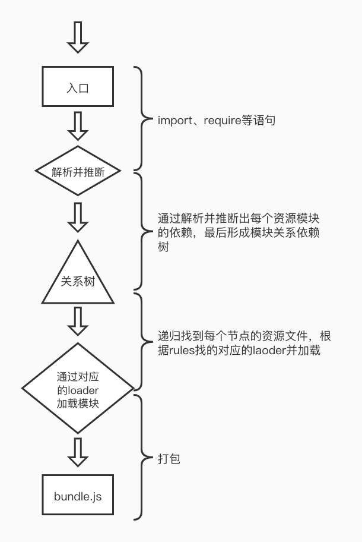

##### 一、Webpack 的构建流程主要有哪些环节？如果可以请尽可能详尽的描述 Webpack 打包的整个过程



webpack会顺着打包入口文件中的<font color=red>import</font>、<font color=red>require</font>语句，通过解析这些语句并推断出依赖的资源模块，然后分别去解析每个资源模块对应的依赖，最后形成了一个项目文件依赖的关系树，webpack递归整个依赖树，找到每个节点对应的资源文件，然后根据配置文件中`rules`属性，找到对应模块的加载器并交给加载器加载模块，最后整个打包到bundleJS文件中

##### 二、Loader 和 Plugin 有哪些不同？请描述一下开发 Loader 和 Plugin 的思路。

loader 是加载资源的，而plugin是完成除了加载以外的工作的插件

**开发：**

Loader: loader是一个管道的概念，开发一个loader需要满足输入->转换（处理）->输出的一个过程，同时前一个loader输出结果要能交给下一个loader能继续完成接下来的操作

```javascript
module.exports = source => {
  // source 输入的资源  
  return '处理后结果'
}
```

Plugin: plugin是通过在webpack生命周期钩子中挂载实现功能扩展，plugin必须是一个函数或者一个包含apply方法的对象，apply接收一个webpack在工作过程中核心对象 compiler ，将挂载到compiler.hooks对应的钩子上。