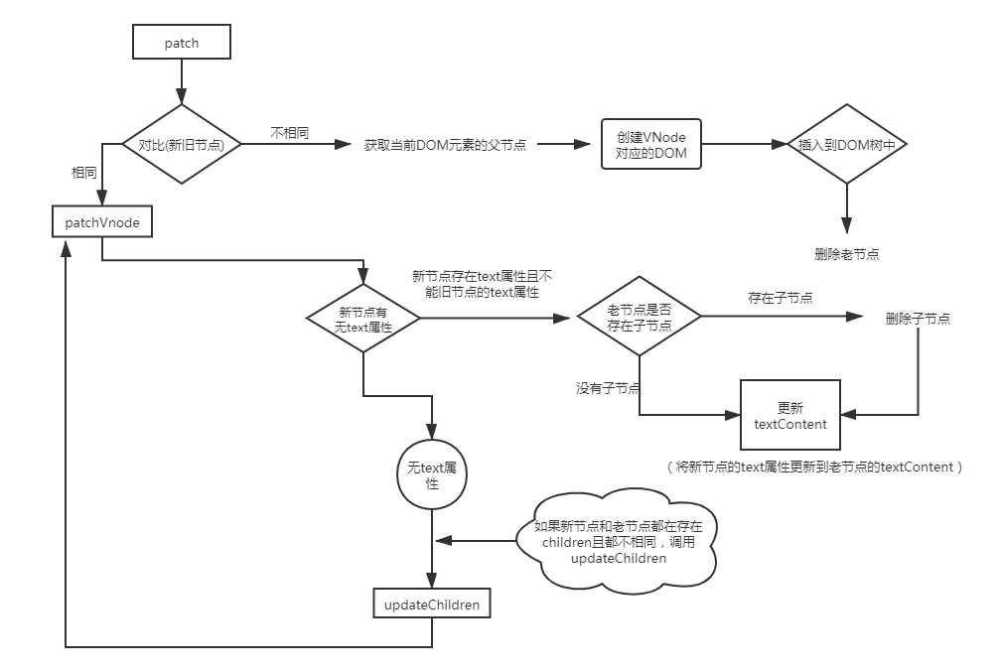

#### 一、当我们点击按钮的时候动态给 data 增加的成员是否是响应式数据，如果不是的话，如何把新增成员设置成响应式数据，它的内部原理是什么。
```javascript
let vm = new Vue({
 el: '#el'
 data: {
  o: 'object',
  dog: {}
 },
 method: {
  clickHandler () {
   // 该 name 属性是否是响应式的
   this.dog.name = 'Trump'
  }
 }
})
```

答案：

动态给data增加的成员不是响应式数据

原因：将data转换为响应式数据是在创建vue实例初期，通过defineProperty方法进行数据劫持，将传入的data对象以及它的子属性（对象）也转换成getter/setter 然后注入到实例中，也就是说响应式数据需要在转换成响应式数据的时机添加getter/setter属性，题中dog是响应式数据，而name不是，就是在转换响应式数据的时候，dog没有name属性，因此name也没有getter/setter属性。

解决办法：

- 将dog设置成 dog: {name: ''}, 这样在初始化的时候就可以将name转换成响应式数据了
- Vue.set(target, key, value) 
  - 内部原理就是增加了defineReactive()方法监听，同样通过defineProperty将对应的属性转换成了getter/setter

#### 二、diff算法过程

> 对比新旧VNode的差异，将差异渲染到DOM（调用patch方法）



##### 调用patch

- 对比旧VNode和新VNode是否相同（kye和sel相同）并找出节点中的差异并更新DOM
  - patchVnode方法
- 如果不相同
  - 获取当前DOM元素 `elm = oldVnode.elm`,并获取当前DOM元素的parent节点
  - 如果父节点(parent)不为空,则把vnode对应的DOM插入到文档中，并删除老节点
- 执行钩子函数
- 返回虚拟Vnode

###### 调用patchVnode

- 如果新节点有text属性，且新节点text属性不等于旧节点的text属性，判断老节点中是否有子节点，如果存在子节点，则移除老节点的子节点，然后将新节点的text属性更新到老节点的textContent
- 如果新节点没有text属性
  - 如果新节点有children，老节点没有children，清空老节点内容（设置了text的情况), 批量添加子节点
  - 如果老节点有children，新节点没有children，则批量删除子节点
  - 如果老节点有text,清空DOM元素
  - 如果新节点和老节点都存在children且`新节点children`和`老节点children`不相同, 则会调用updateChildren方法进行处理

###### 调用updaateChildren

- 如果新的开始节点和旧的开始节点相同，则调用patchVnode方法将差异更新到DOM，并且将对应的索引移动到下一次比较位（oldStartIdex++ / newStartIdx++）
- 如果新的结束节点和旧的结束节点相同，则调用patchVnode方法将差异更新到DOM，并且将对应的索引移动到下一次比较位（oldEndIdex-- / newEndIdx--）
- 如果旧开始节点和新结束节点相同，则调用patchVnode方法更新差异到DOM，将旧开始节点移动到右边，更新索引
- 如果旧结束节点和新开始节点相同，则调用patchVnode方法更新差异到DOM，将旧结束节点移动到左边，更新索引
- 如果以上条件都不满足的话
  - 使用新的开始节点的<font color=red>key</font>去老节点中匹配
    - 如果没有匹配上，说明是新节点，创建对应DOM且插入到DOM树中
    - 如果匹配上了，需判断新节点和老节点的sel(div#app.class)选择器是否相同
      - 如果不同，则说明节点修改了，重新创建对应的DOM元素并插入到DOM树中
      - 如果相同，将elToMove对应的DOM移动到左边
- 算法结尾（循环结束）
  - 如果老节点所有子节点先遍历完，说明新节点有新增，将批量添加到最右边
  - 如果新节点所有子节点先遍历完，说明新节点有删除，将批量删除老节点中的多余节点


