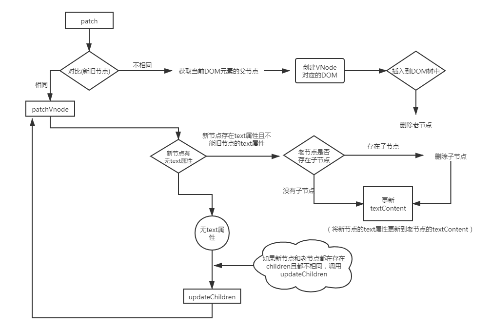

#### 虚拟DOM(Virtual DOM) - snabbdom

##### 虚拟节点(VNode)

> 虚拟节点就是用来描述DOM元素的

##### 将虚拟节点(VNode)渲染成真实DOM 

###### patch 打补丁

> patch 方法返回一个新的VNode节点 作为下一次处理的旧节点

###### patch 过程

- 对比新旧VNode是否相同节点(节点的key和sel相同)

- 如果不是相同节点，删除之前的内容，重新渲染

- 如果是相同节点，再判断新的VNode是否有text,如果有并且和oldVnode的text不同，直接更新文本内容

- 如果新的VNode有children，判断子节点是否有变化，判断子节点的过程使用的就是diff算法

  **diff只进行同级比较**

##### 主要函数解析

###### patch

- 功能
  - 传入新旧VNode，对比差异，将差异渲染到DOM
  - 返回新的VNode, 作为下一次patch的oldVnode
- 执行过程
  - 首先执行模块中的钩子函数 `pre`
  - 如果oldVnode和vnode相同（key和sel相同)
    - 调用`patchVnode`方法，找节点差异并更新DOM
  - 如果oldVnode是DOM元素
    - 把DOM元素转换成oldVnode
    - 调用`createElm`方法把vnode转换成功真实DOM，记录到vnode.elm
    - 把刚创建的DOM元素插入到parent中
    - 移除老节点
    - 触发用户设置的create钩子函数

###### createElm

- 功能
  - createElm(vnode, insertedVnodeQueue), 返回创建的DOM元素
  - 创建vnode对应的DOM元素
- 执行过程
  - 首先出发用户设置的init钩子函数
  - 如果是选择器！，创建评论节点
  - 如果选择器为空，创建文本节点
  - 如果选择器不为空
    - 解析选择器，设置标签的id和class属性
    - 执行模块的create钩子函数
    - 如果vnode有children,创建子vnode对应的DOM，追加到DOM树
    - 如果vnode的text值是string/number，创建文本节点并追加到DOM树
    - 执行用户设置的create函数
    - 如果有用户设置的insert钩子函数，把vnode添加到队列中

###### pathcVnode

- 功能
  - patchVnode(oldVnode, vnode, insertedVnodeQueue)
  - 对比oldVnode和vnode的差异，把差异渲染到DOM
- 执行过程
  - 首先执行用户设置的prepatch钩子函数
  - 执行create钩子函数
    - 首先执行模块的create钩子函数
    - 然后执行用户设置的create钩子函数
  - 如果vnode.text未定义
    - 如果oldvnode.children和vnode.children都有值
      - 调用updateChildren()
      - 使用diff算法对比子节点，更新子节点
    - 如果oldvnode.children有值，oldvnode.children无值
      - 清空DOM元素
      - 调用addvnode(),批量添加子节点
    - 如果oldvnode.chilren有值，vnode.children无值
      - 调用removevnodes(),批量删除子节点
    - 如果oldVnode.text有值
      - 清空DOM元素的内容
  - 如果设置了vnode.text并且和oldvnode.text不等
    - 如果老节点有子节点，全部移除
    - 设置DOM元素的textContent为vnode.text
  - 最后执行用户设置的postpacth钩子函数

###### updateChildren

- 功能

  - diff算法的核心，对比新旧节点的children,更新DOM

- 执行过程

  - 要对比两棵树的差异，我们可以取第一棵树的每一个节点一次和第二棵树的每一个节点比较，但是这样的时间复杂度为O(n^3)
  - 在DOM操作的时候我们很少很少会把一个父节点移动/更新到某一个子节点
  - 因此只需要找同级别的子节点依次比较，然后再找下一级别的节点比较，这样算法的时间复杂度为O(n)

  

  - 在进行同级别节点比较的时候，首先会对新老节点数组的开始和结尾节点设置标记索引，遍历的过程中移动索引
  - 在对开始和结束节点比较的时候，总共有四种情况
    - oldStartVnode / newStartVnode - 旧开始 / 新开始
    - oldEndVnode / newEndVnode - 旧结束 / 新结束
    - oldStartVnode / oldEndVnode - 旧开始 / 新结束
    - oldEndVnode / newStartVnode - 旧结束 / 新开始

  

  - 如果oldStartVnode和newStartVnode是sameVndoe (相同)
    - 调用patchVnode()对比和更新节点
    - 把旧开始和新开始索引往后移动 oldStartIdx++/newStartIdx++

  

  - oldStartVnode / newEndVnode 是sameVnode（相同）
    - 调用patchVnode() 对比和更新节点
    - 把oldStartVnode对应的DOM元素，移动到右边
    - 更新索引

  

  - oldEndVnode / newStartVnode 是sameVnode（相同）
    - 调用patchVnode() 对比和更新节点
    - 把oldEndVnode对应的DOM元素，移动到左边
    - 更新索引

  

  - 如果都不满足以上四种情况
    - 遍历新节点，使用newStartNode的key在老节点数组中找相同节点
    - 如果没有找到，说明newStartNode是新节点
      - 创建新节点对应的DOM元素，插入到DOM树中
    - 如果找到了
      - 判断新节点和找到的老街店sel选择器是否相同
      - 如果不相同，说明个节点被修改了
        - 重新创建对应的DOM元素，插入到DOM树中
      - 如果相同，把elToMove对应的DOM元素，移动到左边

  

  - 循环结束

    - 当老节点的所有子节点先遍历完 （oldStartIdx > oldEndIdx ), 循环结束，`说明：新节点有剩余，把剩余节点批量插入到右边`

    

    - 当新节点的所有子节点先遍历完(newStartIdx > newEndIdx), 循环结束，`说明：老节点有剩余，把剩余节点批量删除`

    

##### diff过程中key的作用

> key的作用其实就是为了更高效的更新虚拟DOM，并且保证正确的渲染

在同一个父元素中的子元素，都建议设置key属性，就是每一个子节点的唯一标识，diff算法可以正确的识别该节点，并找到正确的位置插入新的节点

