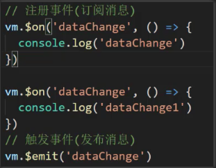
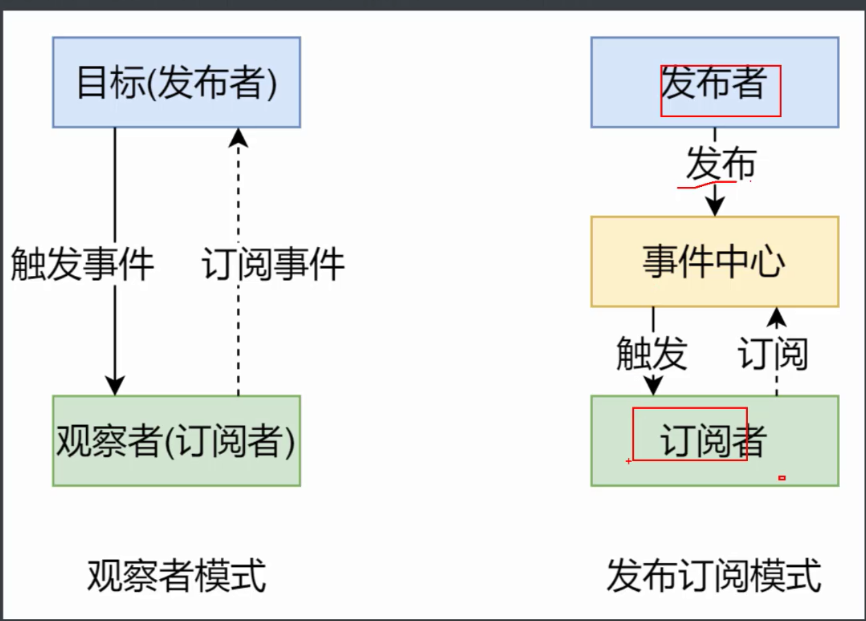
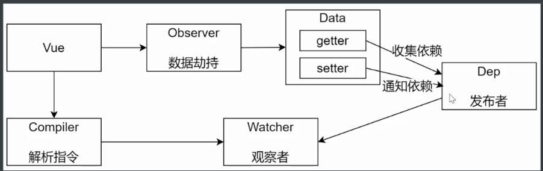
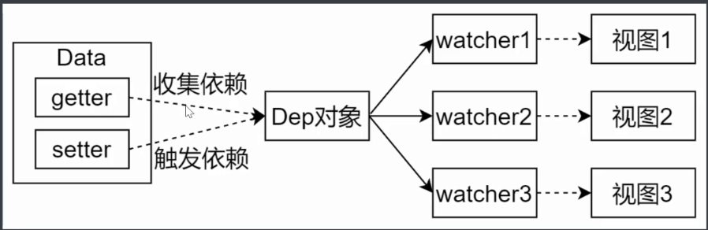
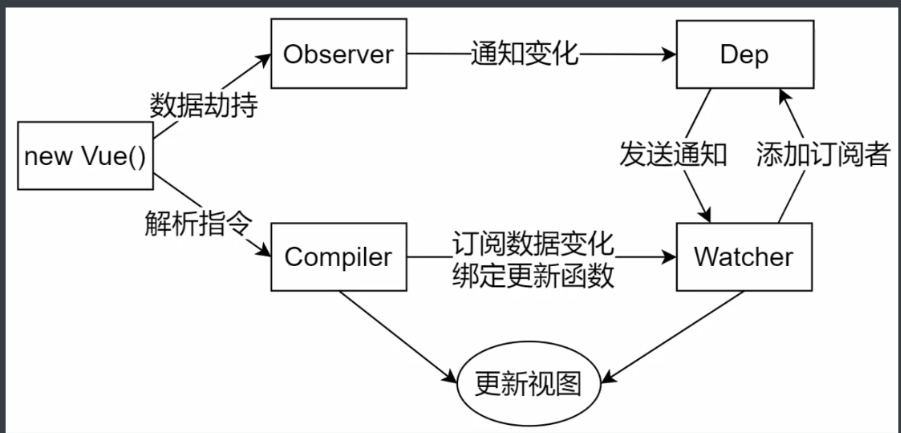

#### vue响应式原理

##### vue2

> 通过  Object.definePropert 进行数据劫持

```javascript
let data = {
    msg: 'hello',
    count: 10
}
let vm = {} // 模拟vue实例
proxyData(data)
function proxyData(data) {
    // 遍历data对象所有属性
    Object.keys(data).forEach(key => {
        // 将data中的属性，转换成vm的setter/getter
        Object.defineProperty(vm, key, {
            // 可枚举 （可遍历）
            enumerable: true,
            // 可以配置（可以使用delete删除，可以通过defineProperty重新定义
            configurable: true,
            // 当获取值得时候执行
            get() {
                return data[key]
            },
            set(newValue) {
                if(newValue === data[key]) return
                data[key] = newValue
            }
        })
    })
}
```

##### vue3

> 通过Proxy实现代理对象

```javascript
let data = {
    msg: 'hello',
    count: 0
}
let vm = new Proxy(data, {
    // 代理的目标对象， key是目标对象对应的属性key
    get(target, key) {
        return target[key]
    },
    set(target, key, newValue) {
        if(target[key] === newValue) return
        target[key] = newValue
    }
})
```

##### 发布订阅模式



```javascript
  // 事件处理器
class EventEmitter {
    constructor() {
        this.subs = Object.create(null)
    }
    // 注册事件
    // event 事件名  
    // handler 事件处理函数
    $on(event, handler) {
        this.subs[event] = this.subs[event] || []
        this.subs[event].push(handler)
    }
    // 处理事件
    // 1.判断当前事件是否存在处理方法
    // 2.出发对应事件的所有处理方法
    $emit(event) {
        if(this.subs[event]) {
            this.subs[event].forEach(handler => {
                handler()
            })
        }
    }
}
```

##### 观察者模式

- 观察者（订阅者）—Watcher
  - update() —当事件发生时，具体要做的事情
- 发布者—Dep
  - subs数组： 存储所有的观察者
  - addSub(): 添加观察者
  - notify(): 当事件发生，调用所有观察者的update()方法

```javascript
// 发布者 
class Dep {
    constructor() {
        // 记录所有订阅者
        this.subs = []
    }
    addSub(sub) {
        // 判断sub是否是一个观察者对象
        // 观察者对象具有update方法
        if(sub && sub.update) {
            this.subs.push(sub)
        }
    }
    // 发布通知
    notify() {
        this.subs.forEach(sub => {
            sub.update()
        })
    }
}
// 观察者
class Watcher {
    update() {
        console.log("update")
    }
}

let dep = new Dep()
let watcher = new Watcher()
dep.addSub(watcher)
dep.notify()
```



- `观察者模式` 是由具体目标调度，比如当事件触发，Dep就会去调用观察者的方法，所以观察者模式的订阅者与发布者之间存在依赖关系
- `发布/订阅模式`由 统一调度中心调度， 因此发布者和订阅者不需要知道对方的存在

##### 模拟vue响应式原理

- 功能
  - 负责接收初始化的参数（选项）
  - 负责吧data中属性注入到Vue实例， 转换成getter/setter
  - 负责调用observer监听data中所有属性的变化
  - 负责调用compiler解析指令/差值表达式

###### Observer

- 负责吧data选项中的属性转换成响应式数据
- data中的某个属性也是对象， 把该属性转换成响应式数据
- 数据变化发送通知

###### Compiler

- 负责编译模板，解析指令/差值表达式
- 负责页面首次渲染
- 当数据变化后重新渲染视图

###### Compiler中的方法

- 构造函数（constructor)

  ```javascript
  constructor(vm) {
      this.el = vm.$el
      this.vm = vm
      // 自执行函数  调用compiler 开始编译
      this.compile(this.el)
  }
  ```

- compile(el)  编译模板，处理文本节点和元素节点

  - 获取当前元素的所有子节点

  - 遍历所有子节点

  - 判断节点类型 ，并调用对应的处理方法（文本节点、元素节点）

  - 如果当前节点存在子节点，则递归调用compile方法，继续编译处理节点

    ```javascript
    compile(el) {
        // 获取节点的子节点
        let childNodes = el.childNodes
        Array.from(childNodes).forEach(node => {
            if(this.isTextNode(node)) {  // 处理文本节点
                this.compileText(node)
            }else if(this.isElementNode(node)) {  // 处理元素节点
                this.compileElement(node)
            }
            // 如果当前节点 存在子节点 则递归调用complie 处理
            if(node.childNodes && node.childNodes.length) {
                this.compile(node)
            }
        })
    }
    ```

    

- compileElement(node) 编译元素节点，处理指令

  - 获取节点的所有属性

  - 比那里所有属性

  - 判断当前属性是否是指令

  - 如果是指令则调用对应的处理方法

    ```javascript
    // 编译元素节点，处理指令
    compileElement(node) {
        // 获取节点的所有属性
        let attributes = node.attributes
        // 遍历所有属性
        Array.from(attributes).forEach(attr => {
            let attrName = attr.name
            if(this.isDirective(attrName)) { // 判断是否是指令
                attrName = attrName.substr(2)
                let key = attr.value // 变量名 例：v-text="msg"
                this.update(node, key, attrName)
            }
        })
    }
    update(node, key, attrName) {
        let updateFn = this[attrName + 'Updater']
        updateFn && updateFn.call(this, node, this.vm[key])
    }
    // 处理v-text指令
    textUpdater(node, value, key) {
        node.textContent = value
        new Watcher(this.vm, key, (newValue) => {
            node.textContent = newValue
        })
    }
    // 处理v-model 指令
    modelUpdater(node, value， key) {
        node.value = value
        new Watcher(this.vm, key, (newValue) => {
            node.value = newValue
        })
        
        // 双向绑定
        node.addEventListener('input', () => {
            this.vm[key] = node.value
        })
    }
    ```

    

- compileText(node) 编译文本节点，处理差值表达式

  - 正则匹配出差值表达式中变量名

  - 提取该变量并处理空格字符

  - 用该变量去当前实例（this.vm)中获取对应的值

  - 将文本节点中的变量名替换为对应的值

    ```javascript
    compileText(node) {
        /**
             * 处理文本节点思路：
             * 1.正则匹配出差值表达式中的变量名
             * 2.提取该变量名并处理空格字符
             * 3.用该变量去当前实例（this.vm）中获取对应的值
             */
        let reg = /\{\{(.+?)\}\}/
        let value = node.textContent
    
        if(reg.test(value)) {
            let key = RegExp.$1.trim()
            node.textContent = value.replace(reg, this.vm[key])
       		// 创建watcher对象，当数据改变更新视图
            new Watcher(this.vm, key, (newValue) => {
                node.textContent = newValue
            })
        }
    }
    ```

    

- isDirective(attrName) 判断元素属性是否是指令

  ```javascript
  // 判断元素属性是否是指令
  isDirective(attrName) {
      return attrName.startsWith('v-')     
  }
  ```

  

- isTextNode(node) 判断节点是否是文本节点

  ```javascript
  // 判断节点是否是文本节点
  isTextNode(node) {
      return node.nodeType === 3
  }
  ```

  

- isElementNode(node)判断节点是否是元素节点

  ```javascript
  // 判断节点是否是元素节点
  isElementNode(node) {
      return node.nodeType === 1
  }
  ```

  

辅助方法：

- update(node, key, attrName) 调用对应类型的指令的处理方法

- textUpdater(node, value) 处理v-text指令
- modelUpdater(node, value) 处理v-model 指令

###### Dep 

> 收集依赖、添加观察者、发送通知



- subs 存储所有观察者

- addSub(sub) 添加观察者
- notify() 发送通知

```javascript
class Dep {
    constructor() {
        // 存储所有观察者
        this.subs = []
    }
    // 添加观察者
    addSub(sub) {
        if(sub && sub.update) {
            this.subs.push(sub)
        }
    }
    // 发送通知
    notify() {
        this.subs.forEach(sub => {
            sub.update()
        })
    }
}
```

###### Watcher

> 1.当数据变化出发依赖，dep通知所有的Watcher实例更新视图
>
> 2.自身实例化的时候往dep对象中添加自己



```javascript
class Watcher {
    constructor(vm, key, cb) {
        this.vm = vm
        // data中的属性名称
        this.key = key
        // 回调函数负责更新视图
        this.cb = cb
        // 将wathcer对象记录到Dep类的静态属性target
        Dep.target = this
        this.oldValue = vm[key]
        // 添加完Watcher之后将target置为空，避免出现重复添加
        Dep.target = null
    }
    // 当数据发生变化的时候更新视图
    update() {
        let newValue = this.vm[this.key]
        // 如果新旧值相同 没有变化什么也不做
        if(this.oldValue === newValue) return
        this.cb(newValue)
    }
}
```

### 总结



##### 首次渲染的大致流程:

- new Vue 创建实例
  - 接受初始化数据（选项），将其转换成getter/setter
- Observer 通过defineProperty 进行数据劫持并监听数据变化
  - 会给每一个对象创建一个dep对象，负责收集依赖
  - 数据变化时会调用dep对象的notify方法发送通知
- Dep 依赖收集器，当数据变化时notify会调用watcher对象的update方法来更新视图
- Watcher 观察者 当创建watcher时，watcher会传入一个回调函数，这个回调函数承担着更新视图的作用，watcher的update方法最终也是通过调用这个回调函数来更新视图的
- Compiler 编译模板 ，处理对应类型的节点
  - 在处理对应的文本节点和元素节点时，会创建对应的watcher（如：文本节点、元素节点的指令）并绑定对应的更新视图函数，watcher的update方法调用的回调函数就是该函数（更新视图函数），创建watcher时会触发Observer的get方法，通过`Dep.target && dep.addSub(Dep.target)`收集观察者。

##### 数据改变时流程

- 当数据改变时会触发Observer中的set方法，在set方法中会调用dep.notify方法，由此触发watcher`update`方法调用更新视图回调