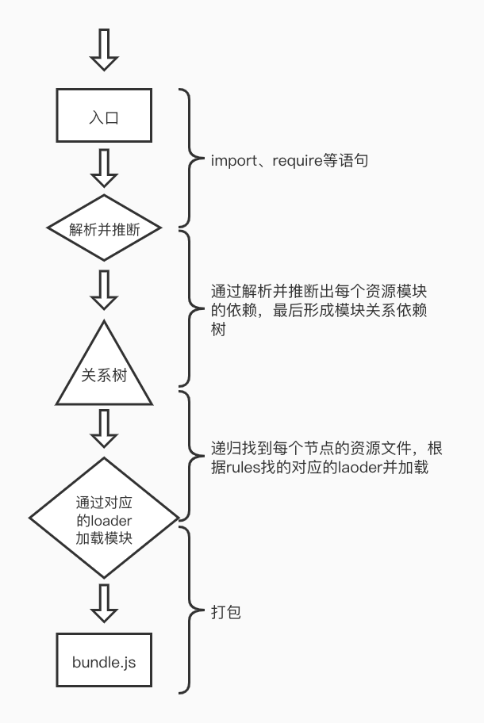

#### webpack知识点

- 配置文件 webpack.config.js

- 工作模式 (mode)

  - none (无模式)
  - development （开发模式）
  - Production （生产模式）

- webpack打包结果和运行原理

  > 就是将多个模块打包到一个文件中，通过添加一些基础代码把模块与模块之间联系起来

- Webpack 资源加载 

  > 通过一系列对应**loader**来加载相应的资源

  - 文件资源加载器 `file-loader`
  - URL加载器 `url-loader`  *小文件使用url-loader减少请求次数*，<font color=red>需要安装file-laoder,因为内部是依赖file-loader</font>

- 加载器分类

  - 编译转换类
  - 文件操作类
  - 代码检查类

- Webpack 转换 ES 2015 

  > 需要使用babel平台以及平台上一些相关插件进行转换 

  - `yarn add babel-loader @babel/core @babel/preset-env --dev`

  ```javascript
  {
    test: /.js$/,
   	use: {
      loader: 'babel-loader',
      options: {
        presets: ['@babel/@preset-env']
      }
    }
  }
  ```

- Webpack 加载资源方式

  - 遵循ESmodule标准的import 声明

  - 遵循CommonJS标准的require函数

  - 遵循AMD标准的define函数和require函数

  - @import指令和url函数

  - img标签src函数 、a标签的href   *需要html-loader配合使用*

    ```javascript
    {
      test: /.html$/,
      use: {
        loader: 'html-loader',
        options: {
          atttrs: ['img:src', 'a:href']
        }
      }
    }
    ```

    **总结**: webpack找出项目中所有引用到的资源文件，通过不同的loader进行处理，最后将处理的结果整体打包到输出目录。

- webpack核心工作原理

  > webpack会顺着打包入口文件中的<font color=red>import</font>、<font color=red>require</font>语句，通过解析这些语句并推断出依赖的资源模块，然后分别去解析每个资源模块对应的依赖，最后形成了一个项目文件依赖的关系树，webpack递归整个依赖树，找到每个节点对应的资源文件，然后根据配置文件中`rules`属性，找到对应模块的加载器并交给加载器加载模块，最后整个打包到bundleJS文件中



- 开发loader

  每个loader会导出一个函数

  ```javascript
  module.exports = source => {
  // source 输入的资源
    return '处理后结果'
  }
  ```

  > Loader 是一个管道的概念，loader1 -> loader2 -> loader3 最终输出结果, 其实就是对资源`输入`->`转换`->`输出`的一个过程

- Webpack 插件机制 

  **webpack插件机制也就是钩子机制，在整个工作过程中有很多的环节，在每一个环节都埋下了一个钩子，插件就是给不同的环节挂载不同的任务，从而扩展webpack的能力—(<font color=red>通过在webpack生命周期的钩子中挂载函数实现扩展</font>)**

  > plguins 是处理除了加载以外的一些工作

  - 自动清除目录	`yarn add clean-webpack-plugin --dev`

    ```javascript
    {
      plugins: [ new CleanWebpackPlugin() ]
    }
    ```

  - 自动生成HTML `yarn add html-webpack-plugin --dev`

    ```javascript
    {
      plugins: [
        new HtmlWebpackPlugin({
          title: 'title',
          template: 'template.html', //模板
          filename: 'filename.html', //文件名
        })
      ]
    }
    ```

  - 开发webpack插件

    > Webpack 插件必须是一个函数或者一个包含apply方法的对象，<font color=red>apply 方法接收一个compiler对象—webpack在工作过程中的核心对象</font>

    ```javascript
    // 实现清除打包js文件没有必要的注释
    // 分析：
    // 清除注释应该是所有任务处理完成之后，即将输出成品代码时的这个阶段
    // 因此：
    // 1.需要在即将往输出目录输出时挂载任务，也就是webpack的 emit 钩子
    class MyPlugin {
      apply(compiler) {
        console.log("Myplugin启动")
    		// 注册一个钩子函数    
        compiler.hooks.emit.tap('MyPlugin', compilation => {
          // compilation 是此次打包的上下文
          for(const name in compilation.assets) {
            if(name.endWitg('.js')) {
              const contents = compilation.assets[name].source()
              const withoutComments= contents.replace(/\/\/*\*+\*\//g,'')
              compilation.assets[name] = {
                source: () => withoutComments,
                size: () => withoutComments.length
              }
            }
          }
        })
      }
    }
    ```

- webpack dev server

  - 静态资源访问 `contentBase`

    ```javascript
    devServer: {
      contentBase: '资源目录'
    }
    ```

- 为项目注入全局成员 `Webpack DefinePlugin`

- Webpack 生产环境优化

  - Tree shaking 优化掉未引用的代码 

    <font color=red>必须是ES Module组织的代码</font>

    ```javascript
    optimization: {
      usedExports: true, // 开启未引用代码优化
      minimize: true // 开启压缩
    }
    ```

  - 合并模块

    ```javascript
    optimization: {
     concatenateModules: true // 将所有模块合并输出到一个函数中
    }
    ```

  - 副作用 `sideEffects`

    ```javascript
    //webpack.config.js
    optimization: {
     sideEffects: true // 开启webpack副作用， 当打包的时候 回去检查package.json中有sideEffects有么有副作用，如果没有副作用的话，就会把导出没有引用到的模块移除掉
    }
    ```

    **开启webpack副作用， 当打包的时候 回去检查package.json中有sideEffects有没有副作用，如果没有副作用的话，就会把导出没有引用到的模块移除掉**

    ```javascript
    //package.json
    "sideEffects": false
    // 表示这个项目代码没有副作用
    ```

  - 代码分割 `多入口打包`、`动态导入`

    - 多入口打包

      ```javascript
      //webpack.config.js
      module.exports = {
        entry: {
          './entry/index1.js',
          './entry/index2.js'
        },
        output: {
          filename: '[name].bundle.js'
        },
        plugins: [
          new HtmlWebpackPlugin({
            title: 'title',
            template: 'index1.html', //模板
            filename: 'index1.html', //文件名
            chunks: ['index1'] // 指定对应的bunlde
          }),
           new HtmlWebpackPlugin({
            title: 'title',
            template: 'index2.html', //模板
            filename: 'index2.html', //文件名
            chunks: ['index2']// 指定对应的bunlde
          })
        ]
      }
      ```

    - 提取公共部分

      ```javascript
      //webpack.config.js
      optimization: {
        splitChunks: {
          chunks: 'all'
        }
      }
      ```

    - 动态导入 通过 `import`方法导入

      ```javascript
      import(/*webpackChunkName: index1*/'./index1').then((default: index1) => {
        
      })
      import(/*webpackChunkName: index2*/'./index2').then((default: index2) => {
        
      })
      ```

      /**/ 魔法注释，可以打包指定的bundle, 如果webpackChunName名字一样的话，就会打包到一起

  - 提取css `yarn add mini-css-extract-plugin --dev`

    ```javascript
    //webpack.config.js
    module.exports = {
      {
        test: /\.css$/,
        use: [
      	//'style-loader', // 将样式通过style标签引入
      	MiniCssExtractPlugin.loader, // 通过link方式引入
      	'css-loader'
      ]
      },
      plugins: [
       new MiniCssExtractPlugin()
      ]
    }
    ```

  - 压缩css `yarn add optimize-css-assets-webpack-plugin --dev`

    这个插件可以添加到webpack的plugins数组中，这时在任何情况下都可以工作

    ```javascript
    {
      plugins: [
        new OptimizeCssAssetsWebpackPlugin()
      ]
    }
    ```

    也可以添加到optimizeation 属性的 minimizer 数组中, 这时只有当optimizeation属性开启时才会生效

    ```javascript
    {
      optimizeation: {
        minimizer: [
           new OptimizeCssAssetsWebpackPlugin()
        ]
      }
    }
    ```

    **注意：**这时会有一个问题是开启了optimization属性的minimizer，必须要同时添加css、js压缩，因为开启之后会把webpack默认的压缩工具给覆盖掉，所以需要手动添加 <font color=red>terser-webpack-plugin</font>

    ```javascript
    {
      optimization: {
        minimizer: [
          new TerserWebpackPlugin(),
          new OptimizeCssAssetsWebpackPlugin()
        ]
      }
    }
    ```

  - 输出文件名hash

    - [name]-[hash].bundle.js  只要项目有任何一个地方发生改动，所有的文件hash都会发生变动
    - [name]-[chunkhash].bundle.js chunk级别，不同的chunk有不同的hash值 
    - [name]-[contenthash].bundle.js 文件级别，不同的文件有不同的hash值

